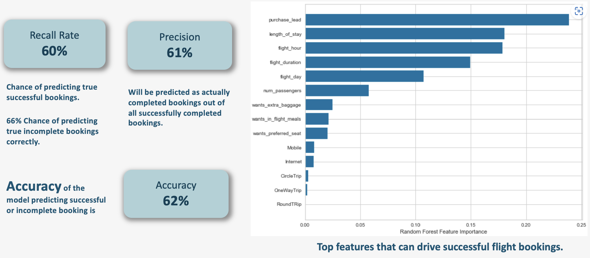

Recent graduate with 6 years of experience in data science, data analysis, data visualization and machine learning, seeking to apply analytical and technical skills to drive data-driven decisions and insights. 

## Work Experience

## 🏢 Texas State University
**Systems Analyst I**  
_Jun 2025 – Present_

- Developed an automated weekly **Power BI fundraising dashboard** integrating Blackbaud Raiser’s Edge and Luminate Online, improving fundraising decision-making by **15%**.
- Automated **10+ reporting and data quality workflows** using Power Automate and SQL validation rules, saving **20+ hours per week**.
- Built end-to-end **Power Automate workflows using Power Fx**, reducing year-end statement processing time by **30%** and improving accuracy.
- Developed a **Power Apps mobile application** for donor portfolio management, increasing outreach completion by **25%** and reducing manual entry by **40%**.
- Optimized SQL queries improving execution performance by **18%** and ensuring reliable reconciliation across systems.
- Led **UI/UX redesign of donation web forms** using HTML, CSS, JavaScript, improving completion rates by **25%**.
- Integrated **API-based data sync pipelines**, reducing manual entry by **50%**.
- Built automated ETL pipelines using **Python, Azure Data Factory, Databricks, and ADLS Gen2**, reducing manual data collection by **80%**.
- Provided **database administration support**, including performance tuning, indexing, and security maintenance.
- Delivered donor analytics insights contributing to **12% increase in retention** and **10% increase in alumni donations**.

---

## 🏢 Revotyx LLC
**Data Engineer**  
_Sep 2024 – Jun 2025_

- Engineered production-grade data pipelines using **Python, SQL, Azure Databricks (Delta Lake), and Azure Data Factory**.
- Ingested and processed **1M+ job postings via REST APIs**, improving lead targeting accuracy by **30%**.
- Consolidated **10+ data sources** into centralized **ADLS Gen2 + Delta Lake** supporting batch & real-time analytics.
- Enabled predictive lead scoring models, increasing **sales conversion efficiency by 25%**.
- Implemented **Row-Level Security (RLS), scheduled refresh, and deployment pipelines in Power BI Service**.
- Integrated **Azure Key Vault** for secure credential management.
- Built **CI/CD pipelines using Azure DevOps**, YAML release pipelines, and pull requests.
- Improved ML and dashboard delivery speed by **40%** through structured data quality frameworks.

---

### Data Analysis & BI Assistant | TXST- Austin,TX
_Feb 2024 – May 2024_

- Built a comprehensive dashboard using Excel (formulas, macros, pivot tables, vlookup) tracking over 5,000 correspondence logs, allowing the stakeholders to identify high-volume request types and reduce response times by 15%.
- Developed Power BI dashboard by utilizing Power Query for ETL processes to clean, transform, and merge student enrollment and academic performance data. The dashboard provided actionable insights that helped the college administration launch 13 new academic programs based on trends and performance metrics.
- Created custom Power Apps to streamline student inquiries and automate manual processes, including complex workflows with approval processes, notifications, and data synchronization. Integrated Power Automate with various data sources and services such as SharePoint and Microsoft Teams, resulting in a 30% reduction in manual tasks and enhanced operational efficiency.
- Implemented advanced DAX functions and drill-through capabilities to provide detailed insights on common student inquiries, resulting in a 20% drop in common student inquiries the following semester by conducting targeted workshops and sending newsletters based on the most frequent requests.

---

**Applied Data Science Intern | Adobe Commerce -  Austin,TX**  
_Aug 2023 - Dec 2023_  
- Performed data analysis on 60,000 tickets from the CRM system in python using regex and NLP libraries (Spacy, NLTK) for data cleansing and tagging, and statistical analysis packages in R for model validation and accuracy assessment.
- Utilized topic modeling techniques (LDA, BERT) and deep learning classification algorithms, improving classification accuracy to 95%, which contributed to increased customer satisfaction.
  

- Gained hands-on experience building CI/CD pipelines with GitLab, resulting in a 30% reduction in deployment time and improved integration efficiency across projects.
  
 

## 🏢 Tata Consultancy Services
_Nov 2018 – Apr 2022_

### Data Analyst – ICICI Lombard

- Built and maintained **10+ Power BI dashboards** across insurance product lines.
- Reduced fraud anomalies by **15%**.
- Automated regulatory reporting using **Python, Power Automate**, reducing manual effort by **60%**.
- Identified **100+ data anomalies during UAT**.
- Improved data quality score from **82% to 95%**.
- Developed scalable pipelines using **Azure SQL, ADF, and Databricks**.
- Enabled self-service analytics for **100+ users**.

---

### IT Analyst
_Aug 2016 – Nov 2018_

- Processed **1M+ policy and claims records**, reducing processing time by **15%**.
- Reduced reconciliation errors by **35%** through automated validation.
- Standardized reporting using SQL stored procedures, improving efficiency by **25%**.
- Improved audit compliance score by **20%**.
- Documented **30+ ETL workflows and business requirements**.

## Projects

### Network Analysis of Witcher Series
- **Objective:** Increase viewer engagement by analyzing the complex relationships between characters in the Witcher series.
- **Methods:** Utilized network analysis techniques to map out interactions and relationships between over 1,000 characters in the series.
  

- **Results:** Identified key character connections and potential plot development areas, leading to a projected 25% increase in viewer engagement.
- **Tools Used:** BeautifulSoup, Python (NetworkX)

### Data Science Virtual Internship | British Airways
- **Objective:** Improve customer experience by analyzing sentiment in customer reviews.
- **Methods:** Extracted unstructured data from a travel review website using web scraping techniques. Conducted sentiment analysis using Natural Language Processing (NLP) to categorize customer feedback.
- **Results:** Provided actionable insights into customer sentiment, helping British Airways enhance service delivery and customer satisfaction.
- **Tools Used:** Python (BeautifulSoup, Scrapy), NLP (NLTK)
  

### Research Bot using OpenAI
- **Objective:** The Research Bot aims to streamline the analysis of news articles by allowing users to input URLs directly. It enhances the efficiency of retrieving relevant information and answering queries through advanced natural language processing techniques.
- **Methods:** Utilized OpenAI's embeddings to extract and process key information from news articles.
Employed FAISS for efficient storage and retrieval of generated embeddings, enabling fast similarity searches.
Implemented natural language query processing to retrieve relevant answers from the analyzed articles, displaying sources for credibility.
- **Results:** Successfully improved the speed and accuracy of information retrieval, providing users with quick and insightful answers to their queries.
Enhanced customer engagement by enabling dynamic interaction with news content.
**Tools Used:** Python, Streamlit, OpenAI, NLTK, SpaCy, FAISS, LangChain
  

### Database Management System for Car Rental Agency | Texas State University
- **Objective:** Develop a secure and efficient database management system for a car rental agency.
- **Methods:** Designed and implemented a MySQL database to manage customer, rental, and vehicle data securely.
- **Results:** Ensured data integrity and security, streamlined operations, and facilitated easy data retrieval for reporting and analysis.
- **Tools Used:** MySQL, MS SQL Server
  

## Skills

**Programming Languages:** Python, R, SQL  
**BI Tools:** Power BI (Dashboard Development, DAX), Tableau (Desktop/Server)  
**ETL Tools:** SSIS, AWS Glue, Azure Data Factory  
**Databases:** MS SQL Server, PostgreSQL, MySQL, NoSQL, Snowflake  
**Machine Learning:** Scikit-learn, TensorFlow, Keras, NLP (Spacy, NLTK), ARIMA, LSTM, Random Forest, XGBoost, Pandas, Numpy, Seaborn  
**Cloud Platforms:** AWS, Azure

## Education

**Masters in Data Analytics & Information Systems**  
Texas State University, San Marcos, TX  
_August 2022 - May 2024_  
GPA: 4.0/4.0

**Bachelors in Electronics and Communication**  
GITAM University, India  
_2012 - 2016_  
GPA: 8.95/10

## Certifications

- **PL-300** – Microsoft Certified PowerBI Data Analyst Associate
- **Python Certified** – HackerRank  
- **Apache Airflow Certified** – Astronomer  

## Awards:

**Excellence and Commitment Award**, Tata Consultancy Services (TCS)  
  Recognized for outstanding performance and dedication to project success, reflecting commitment to quality and teamwork.
  
**Beta Gamma Sigma Award**, Texas State University
  Honored as a top 10% graduate scholar, acknowledging academic excellence and leadership in business studies.  

